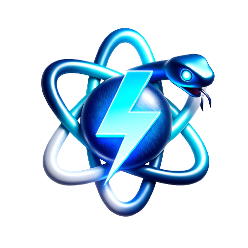

# Template Software Application Project 🚀
<p align="center">
  
</p>
<p align="center">
  <a href="https://github.com/AdrianPayne/fastapi-core/actions/workflows/ci.yml" target="_blank">
      
  </a>
  <a href="https://www.python.org/downloads/release/python-3110/" target="_blank">
      
  </a>
  <a href="https://www.python.org/downloads/release/python-3110/" target="_blank">
      
  </a>
</p>
---

<p align="center">
  <a href="https://www.python.org/">
      
  </a>
  <a href="https://fastapi.tiangolo.com/">
      
  </a>  
  <a href="https://www.docker.com/">
      
  </a>
  <a href="https://react.dev/">
      
  </a>
  <a href="hhttps://react.dev/">
      
  </a>
  <a href="https://firebase.google.com/">
      
  </a>

</p>

---

Welcome to the **Template Software Application Project**! This isn't just another template - it's your one-stop solution to swiftly bootstrap and scale software applications. Built with the modern developer in mind, this template is perfect for those looking to combine the power of FastAPI's high-performance backend capabilities with React-Vite's lightning-fast frontend framework.

## 🌟 Features:

- **Optimized Structure**: Our template ensures a best-practice architecture, allowing you to focus on feature development rather than boilerplate code.
  
- **Swift Development**: With FastAPI in the backend and React-Vite in the frontend, iterate rapidly and deliver features faster than ever.
  
- **Unified Packaging**: Say goodbye to deployment hassles! Everything is neatly packed into a single Docker image, making deployments a breeze.
  
- **Portability**: Whether you're deploying on cloud infrastructure, a local server, or somewhere in between, our Docker integration ensures your application runs seamlessly anywhere.

## Why Choose This Template?

In the fast-paced world of software development, starting with the right foundation can make all the difference. Our template empowers developers to create robust, scalable, and efficient applications without getting bogged down in setup and configuration. Get a head start and bring your software visions to life!

So, ready to transform your next software idea into reality? Dive in, and let's create something amazing together!

## Table of Contents
- [Getting Started](#getting-started)
    - [Prerequisites](#prerequisites)
    - [Directory Structure](#directory-structure)
      - [Backend Structure](#backend-structure)
      - [Frontend Structure](#frontend-structure)
    - [Running the Project](#running-the-project)
      - [Development](#development)
      - [Production](#production)
    - [Testing](#testing)
- [Contributing](#contributing)
    - [Commit Best Practices:](#commit-best-practices)
    - [Development Pipeline:](#development-pipeline)
    - [Coding Standards for Python Backend:](#coding-standards-for-python-backend)
    - [Why Follow These Standards?](#why-follow-these-standards)


## Getting Started

These instructions will get you a copy of the project up and running on your local machine for development and testing purposes.

### Prerequisites

- Docker
- [flyctl](https://fly.io/docs/hands-on/install-flyctl/)

### Directory Structure

```
├── app
│   ├── backend
│   ├── Dockerfile
│   ├── frontend
│   ├── start-dev.sh
│   └── start-prod.sh
├── Makefile
└── README.md
```
#### Backend Structure
```
├── src
│   ├── core
│   ├── helper
│   ├── main.py
│   └── routes
├── pyproject.toml
├── static
└── tests
```

#### Frontend Structure
```
├── index.html
├── node_modules
├── package.json
├── public
├── src
├── tsconfig.json
└── vite.config.ts
```

### Running the Project

#### Development

To run the project in development mode:

```bash
make run-dev
```
This will start the backend with live-reloading enabled and will serve the frontend assets from the static directory.

#### Production
To run the project in production mode:
```bash
make run-prod
```
This will start the backend without live-reloading and will serve the frontend assets from the static directory.

### Testing
To run unittests of the backend, execute:
```bash
make test
```
This will execute the unittests from the [tests folder](/app/backend/tests/) together with a coverage report to calculate the test-coverage for the backend.


## Contributing

Thank you for your interest in contributing to our project! To ensure smooth collaboration and maintain the quality of the codebase, please follow our project best practices outlined below:

### Commit Best Practices:

1. **Atomic Commits**: Make sure each commit addresses one particular issue or enhancement. This makes it easier to review and revert if necessary.

2. **Meaningful Commit Messages**: Start with a concise (50 characters or fewer) title, followed by a more detailed description if necessary. Use the imperative mood ("Add feature" not "Added feature" or "Adds feature").

3. **Reference Issue Numbers**: If your commit addresses an open issue, include a reference to the issue number in the commit message.

**Example Commit Message**:
```
Feature-{issue number} Added authentication for API endpoints

Changes:
 - Added authentication for API endpoints.
 - ...
```
### Development Pipeline:

1. **Feature Development**:
   - Checkout a new branch from the `dev` branch for your feature: `git checkout -b feature/{issue number}-your-feature-name`.
   
2. **Merging Feature to Dev**:
   - Once the feature is complete and tested, create a pull request to merge it into the `dev` branch. It's recommended to have a peer review before the merge.
   
3. **Promoting Dev to Main**:
   - When the features in the `dev` branch are ready for production, create a pull request to merge `dev` into the `main` branch. Make sure all tests are passing and have received an adequate review.

### Coding Standards for Python Backend:

1. **PEP 8 Compliance**: Follow [PEP 8](https://www.python.org/dev/peps/pep-0008/), the style guide for Python code, to ensure code readability and consistency.

2. **Descriptive Variable and Function Names**: Avoid using vague names like `temp` or `func`. Instead, choose descriptive names that convey purpose and follow snake_case naming convention.

3. **Docstrings**: Use docstrings for all modules, classes, and functions. This makes the codebase more understandable and maintainable.

4. **Error Handling**: Always anticipate and handle potential errors gracefully. Avoid using bare `except` statements.

5. **Keep Dependencies to a Minimum**: Only include necessary external libraries. This helps in keeping the project lightweight and reduces potential security risks.

### Why Follow These Standards?

1. **Consistency**: Maintaining a consistent coding style makes the codebase easier to read, understand, and debug.
2. **Collaboration**: Adhering to the same set of practices reduces friction when multiple developers collaborate on a project.
3. **Quality**: Ensuring commits are atomic and code follows the best practices increases the quality of the software, making it more reliable and robust.
4. **Maintenance**: A well-organized and consistent codebase is easier to maintain and extend in the future.

By contributing, you agree to uphold these best practices. Let's work together to make this project better!
